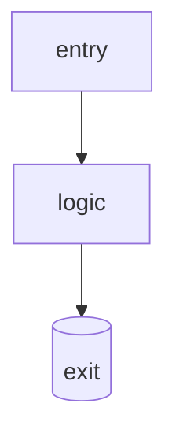

# llmgateway

> LLM gateway: per-token metering, per-tenant budget, failover between providers, Prometheus metrics.

**Status:** under construction. It is a side project: no SLA, no users beyond me
and my notes. If you find it broken, you found a bug of mine, not a missing requirement.

## The problem

<!-- Two lines. Why it exists, not how it works. If you cannot write it, the project is not clear. -->

## What it does

<!-- The capabilities, one per line. Every line must be verifiable by a test or a command. -->

## What it does NOT do

<!-- The denied perimeter. It weighs as much as the asserted one, and it saves you reported bugs. -->

## Usage

```bash
make setup   # dependencies
make dev     # locally
make ci      # lint + typecheck + test: the same thing that runs in CI
```

## Architecture



<!-- A diagram only when it helps. If the repo is small, this block is deleted. -->

## Decisions

The non-obvious ones live in [`docs/adr/`](docs/adr/): context, rejected alternatives, consequences.

## Work status

- [ ] problem issue written
- [ ] tests that define the contract
- [ ] green CI
- [ ] final README
- [ ] release tag

## Development

```bash
git clone git@github.com:paoValle/llmgateway.git
cd llmgateway
make setup && make ci
```

## What I would do differently

<!-- Technical honesty is the strongest seniority signal there is. -->
