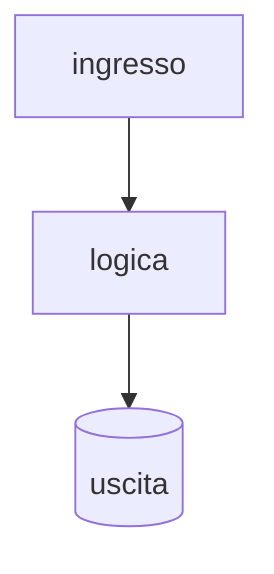

# llmgateway

> Gateway LLM: metering per token, budget per tenant, failover tra provider, metriche Prometheus.

**Stato:** in costruzione. È un side project: nessuna SLA, nessun utente oltre me
e i miei appunti. Se lo trovi rotto, hai trovato un bug mio, non un requisito mancante.

## Il problema

<!-- Due righe. Perché esiste, non come funziona. Se non riesci a scriverlo, il progetto non è chiaro. -->

## Cosa fa

<!-- Le capacità, una per riga. Ogni riga deve essere verificabile da un test o da un comando. -->

## Cosa NON fa

<!-- Il perimetro negato. Vale quanto quello affermato, e ti risparmia le bug segnalate. -->

## Uso

```bash
make setup   # dipendenze
make dev     # in locale
make ci      # lint + typecheck + test: la stessa cosa che gira in CI
```

## Architettura



<!-- Un diagramma solo quando aiuta. Se la repo è piccola, questo blocco si cancella. -->

## Decisioni

Quelle non ovvie stanno in [`docs/adr/`](docs/adr/): contesto, alternative scartate, conseguenze.

## Stato del lavoro

- [ ] issue del problema scritta
- [ ] test che definiscono il contratto
- [ ] CI verde
- [ ] README definitivo
- [ ] tag di release

## Sviluppo

```bash
git clone git@github.com:paoValle/llmgateway.git
cd llmgateway
make setup && make ci
```

## Cosa farei diversamente

<!-- L'onestà tecnica è il segnale di seniority più forte che ci sia. -->